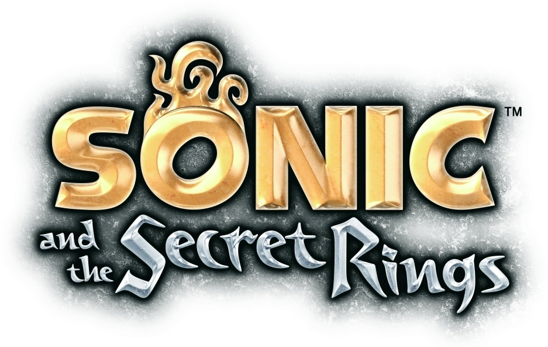

# Sonic and the Secret Rings - Controller Patch

Play **Sonic and the Secret Rings** (Wii) with a **GameCube controller** or a **Classic
Controller** instead of tilting and waving a Wii Remote sideways. Supports story mode and
all game modes across USA (`RSRE01`), European (`RSRP01`), and Japanese (`RSRJ01`) releases.

The patches are applied to your own copy of the game: drop a clean `.wbfs`, `.iso`, or `main.dol`
onto the patcher and play the result on a Wii (USB loader) or in Dolphin. Gecko codes and
Riivolution patches are also included.



## Features

- **GameCube Controller Support**: Native GameCube Controller (Port 1) controls for story mode.
  Left Control Stick steers Sonic and adjusts jump pitch, with full button mappings.
- **Classic Controller Support**: Full Classic Controller and Classic Controller Pro support
  via Wii Remote extension port with Left Stick steering and pitch.
- **Story Mode & Party Mode**: Party mode native GC support is preserved while story mode
  now supports GameCube & Classic Controllers seamlessly.
- **Cross-Region Support**: USA (`RSRE01`), Europe (`RSRP01`), and Japan (`RSRJ01`).

## Controls

### GameCube Controller (Port 1)

| Input | Wii Remote Equivalent | Action |
| --- | --- | --- |
| **Control Stick (Left / Right)** | Tilt Left / Right | Steer Sonic |
| **Control Stick (Forward / Back)** | Tilt Forward / Back | Adjust pitch / flight angle in air |
| **A** | Button 2 | Jump / Accelerate |
| **B** | Button 1 | Brake / Backstep |
| **X** | Button A | Speed Break |
| **Y** | Button B | Time Break |
| **L** | D-Pad Up | Step Left |
| **R** | D-Pad Down | Step Right |
| **D-Pad Left / Right** | D-Pad Up / Down | Sideways D-Pad Navigation |
| **Start** | Plus (+) | Pause |
| **Z** | Minus (-) | Back / Map / Info |

### Classic Controller / Classic Controller Pro

| Input | Wii Remote Equivalent | Action |
| --- | --- | --- |
| **Left Stick (Left / Right)** | Tilt Left / Right | Steer Sonic |
| **Left Stick (Forward / Back)** | Tilt Forward / Back | Adjust pitch / flight angle in air |
| **A** | Button 2 | Jump / Accelerate |
| **B** | Button 1 | Brake / Backstep |
| **X** | Button A | Speed Break |
| **Y** | Button B | Time Break |
| **L / ZL** | D-Pad Up | Step Left |
| **R / ZR** | D-Pad Down | Step Right |
| **D-Pad** | Sideways D-Pad | Menu Navigation |
| **Plus (+)** | Plus (+) | Pause |
| **Minus (-)** | Minus (-) | Back / Map / Info |
| **Home** | Home | Wii Home Menu |

## Using the Patcher

### Desktop GUI Patcher
Run the GUI patcher with Python 3:
```bash
python3 tools/gui.py
```
1. Drag and drop your `Sonic and the Secret Rings` disc image (`.wbfs` / `.iso`) or `main.dol`.
2. Choose your preferred controller mode:
   - **Classic & GameCube Controller Suite (Recommended)**
   - **Classic Controller Support Only**
   - **GameCube Controller Support Only**
3. Click **Apply Patches**. The disc image will be patched and a backup copy (`.bak`) created.

### Command-line Patcher
You can also patch `main.dol` files directly:
```bash
python3 tools/patcher.py /path/to/main.dol /path/to/patched_main.dol --combo
```

## Gecko Codes & Riivolution

- **Gecko Codes**: Ready-to-use cheat codes for Dolphin (`codes/*.ini`) and USB Loaders (`codes/*.txt`).
- **Riivolution**: XML patch included in `riivolution/SonicSecretRings.xml`.

## License

MIT License. See [LICENSE](LICENSE) for details.
